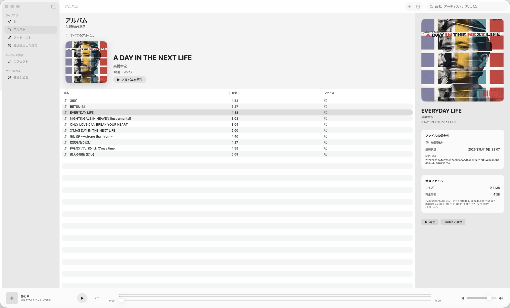

# Ongaku Desktop

Ongaku Desktop is a native macOS music manager and player. It aims to cover the everyday role of Music.app while treating the audio files themselves as durable, inspectable assets.



## Current MVP

- Native three-column SwiftUI library with a persistent player
- Device-aware playback with automatic sample-rate conversion up to 384 kHz
- Multi-file audio import
- Staged copying into `Application Support/Ongaku Desktop/Media`
- SHA-256 verification before a copied file enters the library
- Duplicate detection by content rather than filename
- Atomic JSON manifest updates with a previous-manifest backup
- Atomic import journal with verified recovery after interruption or restart
- Full-library verification with missing, changed, and unreadable states
- English, Japanese, and Simplified Chinese UI
- Embedded artwork with automatic MusicBrainz/Cover Art Archive and Wikidata/Wikimedia fallback
- Universal macOS release packaging for Apple Silicon and Intel Macs
- Signed in-app software updates through the app menu

## Run

Open `OngakuDesktop.xcodeproj` in Xcode, select the `OngakuDesktop` scheme and the `My Mac` destination, then run. The project is intentionally macOS-only with a macOS 14 deployment target.

For command-line development you can also use:

```sh
swift run OngakuDesktop
```

Release archives, signing instructions, and the Sparkle update feed live in
[`Releases`](Releases/README.md). Published builds contain both `arm64` and
`x86_64` slices in one Universal Binary.

The first import creates the managed library under the current user’s Application Support directory. Source files are never modified.

When an audio file has no embedded image, Ongaku looks up an exact album-and-artist or
artist match online. Downloaded thumbnails are kept in the user cache for 30 days;
failed lookups are retried after 24 hours. Ongaku sends only the album and artist names
needed for that lookup and continues to show its local placeholder when offline.
Right-click an album thumbnail and choose the refresh command to bypass both caches and
perform a new lookup immediately; a failed manual lookup keeps the current image intact.

During playback, Ongaku reads the default output device's supported nominal sample
rates and prefers the highest compatible 44.1 kHz or 48 kHz family rate up to
384 kHz. If the device rejects a rate change, playback falls back to its actual
hardware rate. This changes only the playback path, never the managed audio file.

## Data safety model

1. Read and hash the source file.
2. Copy it to an isolated incoming area.
3. Hash the staged copy and compare it with the source.
4. Move the verified copy into an artist/album directory.
5. Keep the import journal until the managed file is represented in the catalog.
6. Atomically update the library manifest, retaining the prior manifest as a backup.

If the app stops between steps 4 and 6, the next launch hashes the managed file again
and restores only entries whose content still matches the recorded checksum. Partial
incoming copies are discarded without modifying source files.

This is a strong local baseline, not a backup strategy. Keep an independent backup of the managed `Media` directory.
